## Q81. How do you back up and restore etcd?

### Simple Explanation
etcd is the database of Kubernetes. It stores everything — all your pods, services, configs. If etcd dies and you have no backup, your whole cluster config is gone. Backing up etcd means saving a snapshot of this database. Restoring means loading that snapshot back.

### Real-World Analogy
Think of etcd as the "save file" of a video game. Backup = making a copy of your save file. Restore = loading that copy when your current save gets corrupted.

### Practical

**Backup etcd (snapshot):**
```bash
ETCDCTL_API=3 etcdctl snapshot save /backup/etcd-snapshot.db \
  --endpoints=https://127.0.0.1:2379 \
  --cacert=/etc/kubernetes/pki/etcd/ca.crt \
  --cert=/etc/kubernetes/pki/etcd/server.crt \
  --key=/etc/kubernetes/pki/etcd/server.key
```

**Verify the snapshot:**
```bash
ETCDCTL_API=3 etcdctl snapshot status /backup/etcd-snapshot.db --write-out=table
```

**Restore etcd from snapshot:**
```bash
ETCDCTL_API=3 etcdctl snapshot restore /backup/etcd-snapshot.db \
  --data-dir=/var/lib/etcd-restore

# Then update the etcd pod manifest to point to the new data dir
# Edit: /etc/kubernetes/manifests/etcd.yaml
# Change --data-dir=/var/lib/etcd to --data-dir=/var/lib/etcd-restore
```

**Automate backup with a CronJob:**
```yaml
apiVersion: batch/v1
kind: CronJob
metadata:
  name: etcd-backup
  namespace: kube-system
spec:
  schedule: "0 2 * * *"   # every day at 2am
  jobTemplate:
    spec:
      template:
        spec:
          hostNetwork: true
          containers:
          - name: etcd-backup
            image: bitnami/etcd:latest
            command:
            - /bin/sh
            - -c
            - |
              ETCDCTL_API=3 etcdctl snapshot save /backup/etcd-$(date +%Y%m%d).db \
                --endpoints=https://127.0.0.1:2379 \
                --cacert=/etc/etcd/ca.crt \
                --cert=/etc/etcd/server.crt \
                --key=/etc/etcd/server.key
            volumeMounts:
            - name: backup
              mountPath: /backup
            - name: etcd-certs
              mountPath: /etc/etcd
          restartPolicy: OnFailure
          volumes:
          - name: backup
            hostPath:
              path: /backup
          - name: etcd-certs
            hostPath:
              path: /etc/kubernetes/pki/etcd
```

### Diagram

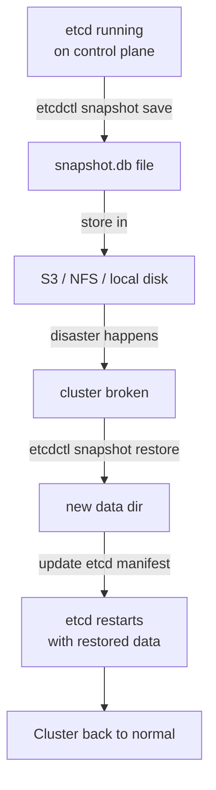

---

## Q82. What is cluster federation?

### Simple Explanation
Cluster federation means managing many Kubernetes clusters as if they were one. You can deploy an app to multiple clusters at the same time from a single control point. This is useful when you have clusters in different regions or cloud providers.

### Real-World Analogy
Think of it like a franchise restaurant chain. Each restaurant (cluster) runs independently, but headquarters (federation) sends the same menu (config) to all of them at once.

### Practical

The modern tool for this is **KubeFed** (Kubernetes Federation v2) or **Fleet** (by Rancher) or **ArgoCD ApplicationSets**.

**Example using KubeFed — federated deployment:**
```yaml
apiVersion: types.kubefed.io/v1beta1
kind: FederatedDeployment
metadata:
  name: my-app
  namespace: default
spec:
  template:
    metadata:
      labels:
        app: my-app
    spec:
      replicas: 3
      selector:
        matchLabels:
          app: my-app
      template:
        metadata:
          labels:
            app: my-app
        spec:
          containers:
          - name: my-app
            image: nginx:1.21
  placement:
    clusters:
    - name: cluster-us-east
    - name: cluster-eu-west
  overrides:
  - clusterName: cluster-eu-west
    clusterOverrides:
    - path: "/spec/replicas"
      value: 5   # EU gets more replicas
```

### Diagram

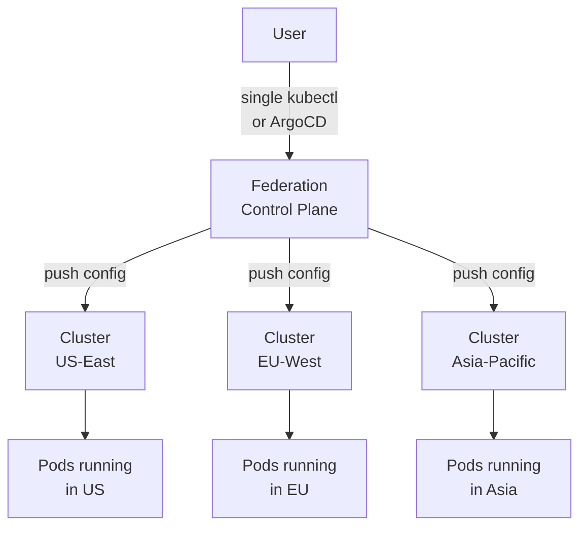

---

## Q83. What are the different ways to provision a Kubernetes cluster?

### Simple Explanation
There are many ways to create a Kubernetes cluster. Some are manual (you control everything), some are automated, and some are fully managed (cloud does the hard work).

### Real-World Analogy
It is like building a house:
- **kubeadm** = building it yourself brick by brick
- **kops** = hiring a contractor who follows your blueprint
- **EKS/GKE/AKS** = buying a ready-made apartment — you just move in

### Practical

**kubeadm (manual, on any server):**
```bash
# On the control plane node
kubeadm init --pod-network-cidr=10.244.0.0/16

# Set up kubectl access
mkdir -p $HOME/.kube
cp /etc/kubernetes/admin.conf $HOME/.kube/config

# Install network plugin (Flannel)
kubectl apply -f https://raw.githubusercontent.com/flannel-io/flannel/master/Documentation/kube-flannel.yml

# On worker nodes — join the cluster
kubeadm join <control-plane-ip>:6443 --token <token> --discovery-token-ca-cert-hash sha256:<hash>
```

**kops (AWS focused):**
```bash
kops create cluster \
  --name=my-cluster.k8s.local \
  --state=s3://my-kops-state \
  --zones=us-east-1a \
  --node-count=3 \
  --node-size=t3.medium \
  --master-size=t3.medium

kops update cluster --name=my-cluster.k8s.local --state=s3://my-kops-state --yes
```

**EKS (AWS managed):**
```bash
eksctl create cluster \
  --name my-cluster \
  --region us-east-1 \
  --nodegroup-name workers \
  --node-type t3.medium \
  --nodes 3
```

**GKE (Google managed):**
```bash
gcloud container clusters create my-cluster \
  --zone us-central1-a \
  --num-nodes 3 \
  --machine-type e2-medium
```

**AKS (Azure managed):**
```bash
az aks create \
  --resource-group myRG \
  --name my-cluster \
  --node-count 3 \
  --node-vm-size Standard_D2s_v3 \
  --generate-ssh-keys
```

### Diagram

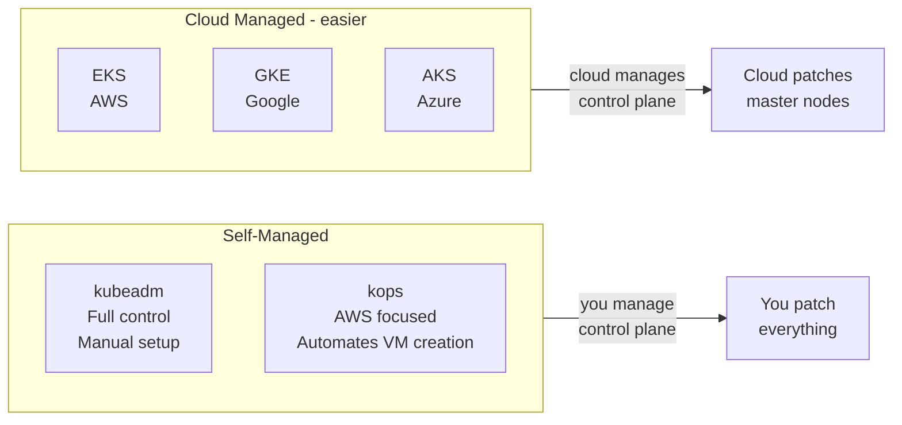

---

## Q84. What is a multi-tenant cluster architecture and its challenges?

### Simple Explanation
Multi-tenancy means multiple teams or customers share the same cluster. Each tenant thinks they have their own cluster, but really they are sharing resources. The big challenge is keeping them isolated — one team should not be able to see, mess with, or consume all the resources of another team.

### Real-World Analogy
Think of an apartment building. Many families live in the same building (cluster), but each family has their own locked apartment (namespace). They share water and electricity (compute), but cannot walk into each other's homes.

### Practical

**Namespace per team:**
```yaml
apiVersion: v1
kind: Namespace
metadata:
  name: team-alpha
  labels:
    team: alpha
---
apiVersion: v1
kind: Namespace
metadata:
  name: team-beta
  labels:
    team: beta
```

**ResourceQuota to limit each tenant:**
```yaml
apiVersion: v1
kind: ResourceQuota
metadata:
  name: team-alpha-quota
  namespace: team-alpha
spec:
  hard:
    requests.cpu: "10"
    requests.memory: 20Gi
    limits.cpu: "20"
    limits.memory: 40Gi
    pods: "50"
```

**NetworkPolicy to isolate teams:**
```yaml
apiVersion: networking.k8s.io/v1
kind: NetworkPolicy
metadata:
  name: deny-cross-namespace
  namespace: team-alpha
spec:
  podSelector: {}
  policyTypes:
  - Ingress
  ingress:
  - from:
    - podSelector: {}   # only pods in same namespace
```

**RBAC to limit what each team can do:**
```yaml
apiVersion: rbac.authorization.k8s.io/v1
kind: RoleBinding
metadata:
  name: team-alpha-admin
  namespace: team-alpha
subjects:
- kind: Group
  name: team-alpha-devs
  apiGroup: rbac.authorization.k8s.io
roleRef:
  kind: ClusterRole
  name: admin
  apiGroup: rbac.authorization.k8s.io
```

### Diagram

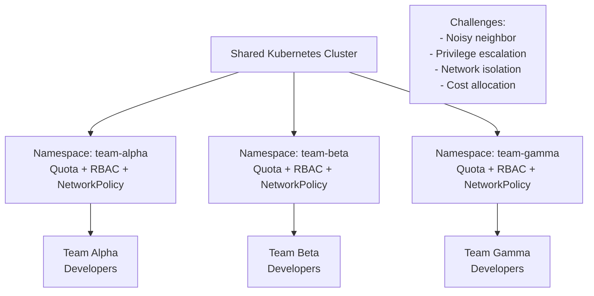

---

## Q85. What is a Service Mesh? What problems does it solve?

### Simple Explanation
A service mesh is extra software that sits between your microservices and handles all the network communication for you. Instead of each service writing code for retries, encryption, and metrics, the mesh handles it automatically.

### Real-World Analogy
Imagine every department in a big company needs to send mail to each other. Without a mail room (service mesh), each department handles their own delivery. With a mail room, all mail goes through one place that handles tracking, security, and delivery — every department just drops off and picks up.

### Problems it solves:
- **mTLS encryption** between services (security)
- **Retries and timeouts** (reliability)
- **Traffic splitting** for canary deployments
- **Observability** — metrics, tracing, logs for every request
- **Circuit breaking** — stop calling a failing service

### Practical

**Without service mesh** — you write this in every service:
```python
# Each service needs retry logic, timeouts, tracing...
import requests
from tenacity import retry, stop_after_attempt

@retry(stop=stop_after_attempt(3))
def call_payment_service():
    return requests.get("http://payment-svc/pay", timeout=5)
```

**With service mesh (Istio)** — just apply a policy:
```yaml
apiVersion: networking.istio.io/v1alpha3
kind: VirtualService
metadata:
  name: payment-svc
spec:
  hosts:
  - payment-svc
  http:
  - retries:
      attempts: 3
      perTryTimeout: 5s
    route:
    - destination:
        host: payment-svc
```

### Diagram

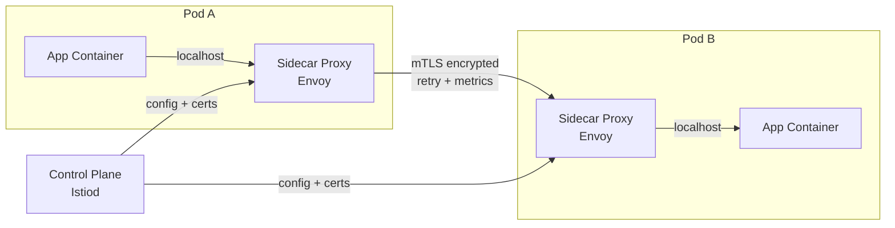

---

## Q86. What is Istio? Explain its control plane and data plane.

### Simple Explanation
Istio is the most popular service mesh. It has two parts:
- **Data plane**: The actual proxies (Envoy sidecars) that sit next to every pod and handle all traffic
- **Control plane**: The brain (called Istiod) that tells all proxies what to do

### Real-World Analogy
Think of a big city's traffic system:
- **Data plane** = the actual traffic lights and road signs on every street
- **Control plane** = the central traffic management center that programs all the lights

### Practical

**Install Istio:**
```bash
istioctl install --set profile=default -y

# Label namespace to auto-inject sidecars
kubectl label namespace default istio-injection=enabled
```

**Traffic management — split traffic 90/10:**
```yaml
apiVersion: networking.istio.io/v1alpha3
kind: VirtualService
metadata:
  name: my-app
spec:
  hosts:
  - my-app
  http:
  - route:
    - destination:
        host: my-app
        subset: v1
      weight: 90
    - destination:
        host: my-app
        subset: v2
      weight: 10
---
apiVersion: networking.istio.io/v1alpha3
kind: DestinationRule
metadata:
  name: my-app
spec:
  host: my-app
  subsets:
  - name: v1
    labels:
      version: v1
  - name: v2
    labels:
      version: v2
```

**Check proxy status:**
```bash
istioctl proxy-status
istioctl analyze
```

### Diagram

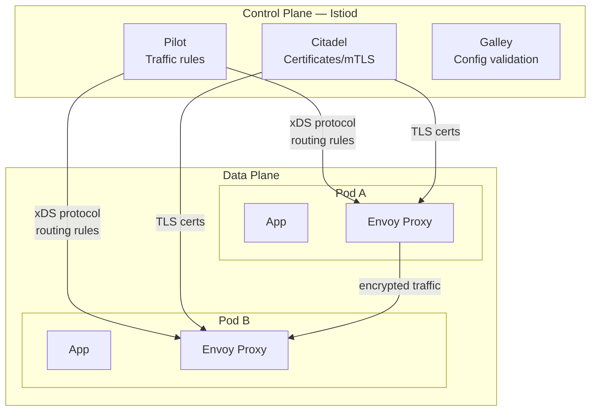

---

## Q87. What is mTLS and how does Istio enforce it?

### Simple Explanation
mTLS stands for **mutual TLS**. Normal TLS means the client checks the server's ID (like when you visit a website). Mutual TLS means BOTH sides check each other's ID. This means even inside your cluster, two services verify each other before talking.

### Real-World Analogy
Normal TLS = showing your ID to enter a building. mTLS = both you AND the security guard show their ID to each other. Both sides prove who they are.

### Practical

**Enable strict mTLS for a namespace:**
```yaml
apiVersion: security.istio.io/v1beta1
kind: PeerAuthentication
metadata:
  name: default
  namespace: production
spec:
  mtls:
    mode: STRICT   # all traffic must use mTLS
```

**Allow permissive mode (both plain and mTLS) during migration:**
```yaml
apiVersion: security.istio.io/v1beta1
kind: PeerAuthentication
metadata:
  name: default
  namespace: production
spec:
  mtls:
    mode: PERMISSIVE  # accepts both plain text and mTLS
```

**Verify mTLS is working:**
```bash
# Check that proxies have certificates
istioctl proxy-config secret <pod-name> -n production

# Check connection is encrypted
kubectl exec -it pod-a -- curl http://pod-b/api  # Envoy handles encryption transparently
```

### Diagram

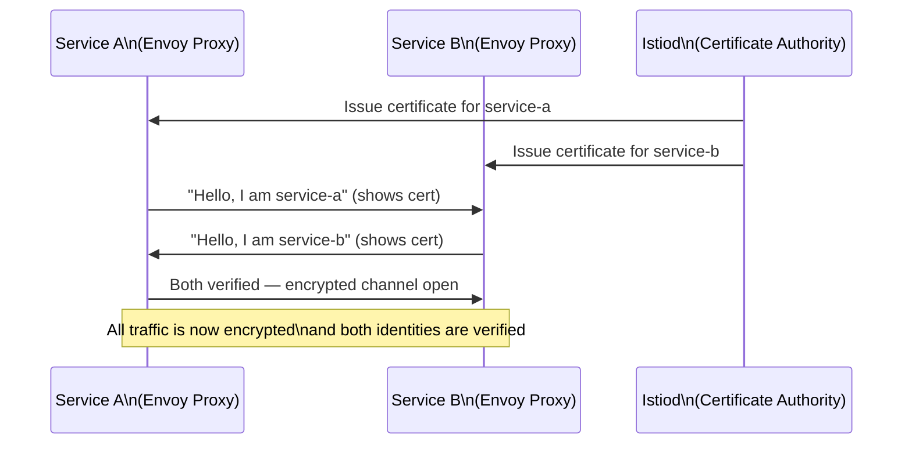

---

## Q88. What is an Envoy proxy?

### Simple Explanation
Envoy is a high-performance network proxy. It is the workhorse inside Istio. Envoy sits next to every pod as a sidecar container and handles all network traffic going in and out. It can do load balancing, retries, circuit breaking, and collect metrics — all without your app knowing.

### Real-World Analogy
Envoy is like a personal assistant for your app. Every call your app makes or receives goes through this assistant first. The assistant handles rescheduling failed calls, tracking how long calls took, and refusing calls when the other party is too busy.

### Practical

**Envoy is injected automatically when namespace is labeled:**
```bash
kubectl label namespace default istio-injection=enabled
kubectl get pod my-pod -o jsonpath='{.spec.containers[*].name}'
# Output: my-app istio-proxy   <-- envoy is the "istio-proxy" container
```

**View Envoy proxy config:**
```bash
# See all clusters Envoy knows about
istioctl proxy-config cluster <pod-name>

# See listeners (what ports Envoy is listening on)
istioctl proxy-config listener <pod-name>

# See routes
istioctl proxy-config route <pod-name>

# Full Envoy config dump
istioctl proxy-config all <pod-name> -o json
```

**Check Envoy logs:**
```bash
kubectl logs <pod-name> -c istio-proxy
```

### Diagram

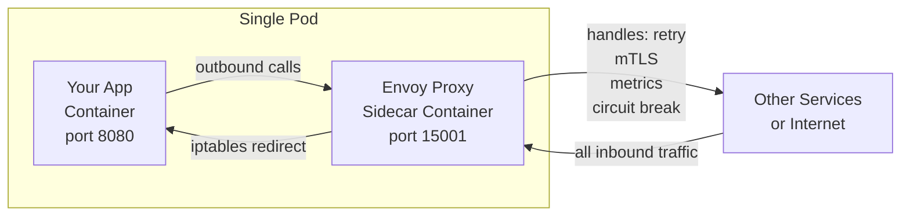

---

## Q89. What is Linkerd and how is it different from Istio?

### Simple Explanation
Linkerd is another service mesh, but it focuses on being simple and lightweight. Istio is very powerful but complex and uses a lot of memory. Linkerd is easier to install and uses less resources — good for teams that want a service mesh without the complexity.

### Real-World Analogy
- **Istio** = a Swiss Army knife with 30 tools. Very powerful, but heavy and complex.
- **Linkerd** = a sharp pocket knife. Does the main job simply and fast.

### Practical

**Install Linkerd:**
```bash
# Install CLI
curl --proto '=https' --tlsv1.2 -sSfL https://run.linkerd.io/install | sh

# Pre-check cluster
linkerd check --pre

# Install control plane
linkerd install | kubectl apply -f -

# Verify
linkerd check

# Inject into a namespace
kubectl annotate namespace default linkerd.io/inject=enabled
```

**Check mesh stats:**
```bash
linkerd viz install | kubectl apply -f -
linkerd viz stat deployments -n default
linkerd viz top deployment/my-app
```

| Feature | Istio | Linkerd |
|---|---|---|
| Proxy | Envoy (C++) | Linkerd2-proxy (Rust) |
| Memory use | Higher (~300MB/proxy) | Lower (~10MB/proxy) |
| Complexity | High | Low |
| Features | Very rich | Core features |
| mTLS | Yes | Yes (automatic) |
| Install time | ~10 minutes | ~2 minutes |

---

## Q90. What is East-West vs North-South traffic?

### Simple Explanation
- **North-South traffic**: traffic coming FROM outside the cluster TO your services (user to app). Like a user opening your website.
- **East-West traffic**: traffic going BETWEEN services inside the cluster. Like your order-service calling payment-service.

### Real-World Analogy
- **North-South** = customers walking into a store from outside
- **East-West** = employees in the store walking between departments to do their jobs

### Practical

**North-South is handled by:**
- LoadBalancer Service
- NodePort Service
- Ingress Controller
- API Gateway

**East-West is handled by:**
- ClusterIP Service (default)
- Service Mesh (Istio/Linkerd) for advanced features

```bash
# Check North-South — external traffic via Ingress
kubectl get ingress -A

# Check East-West — internal service-to-service
kubectl get svc -A | grep ClusterIP

# Test East-West from a pod
kubectl exec -it pod-a -- curl http://payment-service.default.svc.cluster.local/health
```

### Diagram

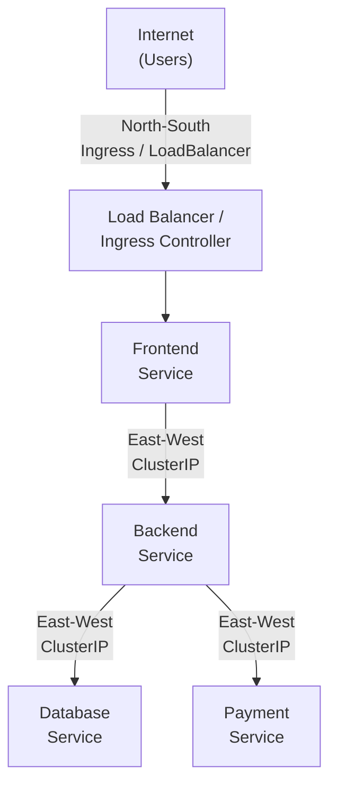

---

## Q91. What is IPVS mode for kube-proxy vs iptables mode?

### Simple Explanation
kube-proxy is the component that makes Services work — it routes traffic from a Service IP to actual pod IPs. It can do this in two ways:
- **iptables mode**: uses Linux firewall rules. Simple but gets slow with many services.
- **IPVS mode**: uses a special Linux kernel load balancer. Much faster with many services.

### Real-World Analogy
- **iptables** = a security guard checking a long paper list of rules one by one. Works fine for 10 rules. Slow for 10,000 rules.
- **IPVS** = a smart computer terminal that does instant lookups. Works just as fast for 10 or 10,000 rules.

### Practical

**Check current kube-proxy mode:**
```bash
kubectl get configmap kube-proxy -n kube-system -o yaml | grep mode
```

**Switch to IPVS mode:**
```bash
# Edit the kube-proxy configmap
kubectl edit configmap kube-proxy -n kube-system
# Change: mode: "" to mode: "ipvs"

# Restart kube-proxy pods
kubectl rollout restart daemonset/kube-proxy -n kube-system
```

**Verify IPVS rules:**
```bash
# On a node
ipvsadm -ln
# Shows virtual servers and real servers (pod IPs)
```

| Feature | iptables | IPVS |
|---|---|---|
| Speed with many services | Slow (linear scan) | Fast (hash table) |
| Load balancing algorithms | Only random | Round-robin, least-conn, etc |
| Kernel module needed | No extra | ipvs module needed |
| Recommended for | Small clusters | Large clusters (1000+ services) |

---

## Q92. How does NodePort actually route traffic end-to-end?

### Simple Explanation
When you create a NodePort Service, Kubernetes opens the same port on EVERY node in the cluster. Traffic coming to any node on that port gets routed to the right pod — even if the pod is on a different node.

### Real-World Analogy
Imagine a hotel with 10 floors (nodes). Any floor's front desk (NodePort) can take your order and send it to the correct kitchen (pod), even if the kitchen is on a different floor.

### Practical

**Create a NodePort service:**
```yaml
apiVersion: v1
kind: Service
metadata:
  name: my-web-svc
spec:
  type: NodePort
  selector:
    app: my-web
  ports:
  - port: 80          # ClusterIP port (internal)
    targetPort: 8080  # Pod port
    nodePort: 30080   # Port opened on every node (30000-32767)
```

```bash
# Apply and check
kubectl apply -f svc.yaml
kubectl get svc my-web-svc

# Access from outside — use ANY node's IP
curl http://<any-node-ip>:30080

# See the iptables rules that make it work
iptables -t nat -L KUBE-NODEPORTS -n
```

### Diagram

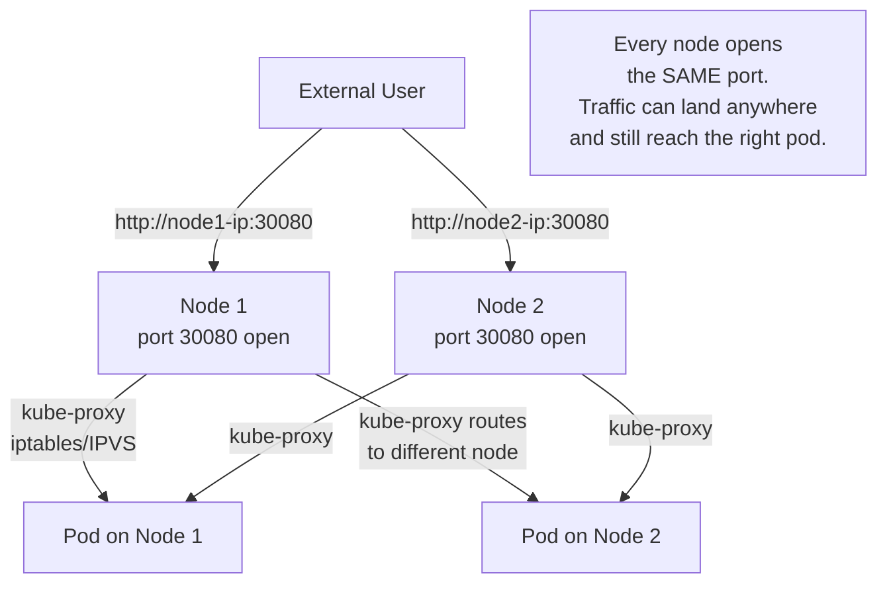

---

## Q93. What is the Container Storage Interface (CSI)?

### Simple Explanation
CSI is a standard way for storage companies to write drivers that plug into Kubernetes. Before CSI, storage drivers were baked into Kubernetes itself — if AWS changed their EBS API, Kubernetes had to release a new version. CSI separates storage from Kubernetes so storage vendors can update their drivers independently.

### Real-World Analogy
Think of CSI like a USB standard. Before USB, every device needed a custom port. With USB (CSI), any storage vendor can make a "USB drive" that plugs into any computer (Kubernetes).

### Practical

**List installed CSI drivers:**
```bash
kubectl get csidrivers
```

**Example: AWS EBS CSI driver StorageClass:**
```yaml
apiVersion: storage.k8s.io/v1
kind: StorageClass
metadata:
  name: ebs-sc
provisioner: ebs.csi.aws.com    # this is the CSI driver
parameters:
  type: gp3
  encrypted: "true"
reclaimPolicy: Delete
volumeBindingMode: WaitForFirstConsumer
```

**Use it in a PVC:**
```yaml
apiVersion: v1
kind: PersistentVolumeClaim
metadata:
  name: my-ebs-pvc
spec:
  accessModes:
  - ReadWriteOnce
  storageClassName: ebs-sc
  resources:
    requests:
      storage: 20Gi
```

**Check CSI node driver:**
```bash
kubectl get csinodes
kubectl describe csinode <node-name>
```

### Diagram

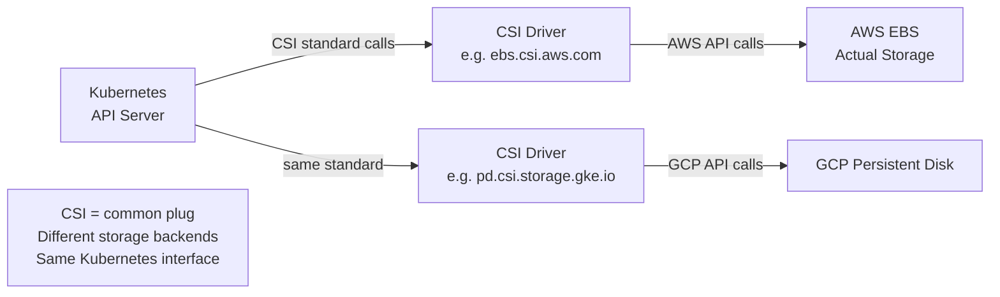

---

## Q94. What is dynamic vs static provisioning of PVs?

### Simple Explanation
- **Static provisioning**: An admin manually creates the PersistentVolume (PV) ahead of time. The developer then creates a PVC and Kubernetes matches it to the pre-made PV.
- **Dynamic provisioning**: The developer creates a PVC with a StorageClass. Kubernetes automatically creates the PV on-demand. No admin needed for each request.

### Real-World Analogy
- **Static** = a hotel where the manager pre-assigns rooms before guests arrive. If all rooms are taken, new guests wait.
- **Dynamic** = a hotel that builds new rooms on demand when guests book. Never runs out.

### Practical

**Static provisioning:**
```yaml
# Admin creates the PV first
apiVersion: v1
kind: PersistentVolume
metadata:
  name: my-manual-pv
spec:
  capacity:
    storage: 10Gi
  accessModes:
  - ReadWriteOnce
  persistentVolumeReclaimPolicy: Retain
  hostPath:
    path: /mnt/data   # on the node

---
# Developer creates PVC — Kubernetes binds to the PV above
apiVersion: v1
kind: PersistentVolumeClaim
metadata:
  name: my-pvc
spec:
  accessModes:
  - ReadWriteOnce
  resources:
    requests:
      storage: 10Gi
  # No storageClassName = uses the manually created PV
```

**Dynamic provisioning:**
```yaml
# StorageClass exists (usually installed with the cluster)
apiVersion: storage.k8s.io/v1
kind: StorageClass
metadata:
  name: fast-ssd
provisioner: ebs.csi.aws.com
parameters:
  type: gp3

---
# Developer just creates a PVC — PV is auto-created
apiVersion: v1
kind: PersistentVolumeClaim
metadata:
  name: my-dynamic-pvc
spec:
  accessModes:
  - ReadWriteOnce
  storageClassName: fast-ssd    # this triggers dynamic provisioning
  resources:
    requests:
      storage: 50Gi
```

### Diagram

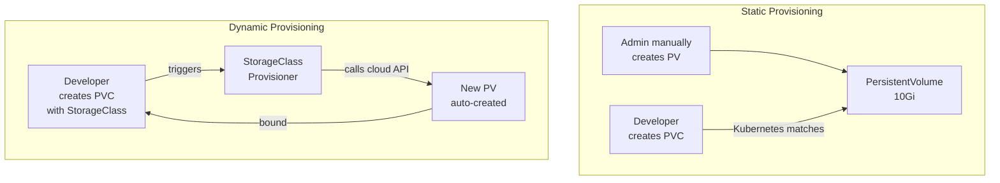

---

## Q95. What is a VolumeSnapshotClass?

### Simple Explanation
VolumeSnapshotClass is like a StorageClass but for snapshots. It defines HOW to take a snapshot — which CSI driver to use and what parameters to use. You need it before you can take a snapshot of a PVC.

### Real-World Analogy
If StorageClass is the "recipe" for creating a disk, VolumeSnapshotClass is the "recipe" for taking a photo of that disk at a point in time.

### Practical

**Create a VolumeSnapshotClass:**
```yaml
apiVersion: snapshot.storage.k8s.io/v1
kind: VolumeSnapshotClass
metadata:
  name: csi-aws-vsc
driver: ebs.csi.aws.com     # which CSI driver handles snapshots
deletionPolicy: Delete       # Delete snapshot when VolumeSnapshot object is deleted
parameters:
  tagSpecification_1: "environment=production"
```

**Take a snapshot of a PVC:**
```yaml
apiVersion: snapshot.storage.k8s.io/v1
kind: VolumeSnapshot
metadata:
  name: my-pvc-snapshot
spec:
  volumeSnapshotClassName: csi-aws-vsc   # use the class above
  source:
    persistentVolumeClaimName: my-pvc    # snapshot this PVC
```

**Restore from snapshot — create PVC from snapshot:**
```yaml
apiVersion: v1
kind: PersistentVolumeClaim
metadata:
  name: restored-pvc
spec:
  accessModes:
  - ReadWriteOnce
  storageClassName: ebs-sc
  resources:
    requests:
      storage: 20Gi
  dataSource:
    name: my-pvc-snapshot
    kind: VolumeSnapshot
    apiGroup: snapshot.storage.k8s.io
```

```bash
# Check snapshot status
kubectl get volumesnapshot
kubectl describe volumesnapshot my-pvc-snapshot
```

---

## Q96. What is the Reclaim Policy (Retain, Recycle, Delete)?

### Simple Explanation
When a PVC is deleted, what happens to the actual storage (PV)? The reclaim policy decides this. There are three options:
- **Delete**: automatically delete the PV and the actual cloud disk. Data is gone.
- **Retain**: keep the PV and the data. An admin must manually clean it up.
- **Recycle**: (old, deprecated) wipe the data and make the PV available again.

### Real-World Analogy
When a hotel guest checks out (PVC deleted), what happens to their room (PV)?
- **Delete** = demolish the room completely
- **Retain** = lock the room, keep all their stuff, call a manager to decide
- **Recycle** = clean the room and make it available for the next guest (deprecated)

### Practical

**Set reclaim policy in StorageClass:**
```yaml
apiVersion: storage.k8s.io/v1
kind: StorageClass
metadata:
  name: safe-storage
provisioner: ebs.csi.aws.com
reclaimPolicy: Retain    # keep data after PVC deleted
```

**Set reclaim policy on a manually created PV:**
```yaml
apiVersion: v1
kind: PersistentVolume
metadata:
  name: my-pv
spec:
  capacity:
    storage: 10Gi
  accessModes:
  - ReadWriteOnce
  persistentVolumeReclaimPolicy: Retain   # keep the data!
  csi:
    driver: ebs.csi.aws.com
    volumeHandle: vol-12345678
```

**Change reclaim policy on existing PV:**
```bash
kubectl patch pv my-pv -p '{"spec":{"persistentVolumeReclaimPolicy":"Retain"}}'
```

**After PVC is deleted with Retain policy:**
```bash
kubectl get pv   # PV shows status "Released" not "Available"
# Admin must manually remove the claimRef to make it reusable
kubectl patch pv my-pv --type json -p '[{"op":"remove","path":"/spec/claimRef"}]'
```

| Policy | Data after PVC delete | Cloud disk | Use case |
|---|---|---|---|
| Delete | Gone | Deleted | Dev/test environments |
| Retain | Safe | Kept | Production databases |
| Recycle | Wiped | Kept (reused) | Deprecated - do not use |

---

## Q97. How do you migrate data in a StatefulSet?

### Simple Explanation
Migrating data in a StatefulSet means moving the persistent storage (database files, etc.) to a new location — new namespace, new cluster, or new storage class — while keeping data intact and minimizing downtime.

### Real-World Analogy
Think of moving a running restaurant to a new building. You cannot just turn off the restaurant. You set up the new location, copy all the kitchen equipment and ingredients (data), test everything, then switch customers to the new address.

### Practical

**Method 1: Snapshot and restore (for cloud PVs):**
```bash
# 1. Scale down StatefulSet to prevent writes during copy
kubectl scale statefulset my-db --replicas=0

# 2. Take a VolumeSnapshot of the PVC
kubectl apply -f - <<EOF
apiVersion: snapshot.storage.k8s.io/v1
kind: VolumeSnapshot
metadata:
  name: my-db-migration-snap
spec:
  volumeSnapshotClassName: csi-aws-vsc
  source:
    persistentVolumeClaimName: data-my-db-0
EOF

# 3. Create new PVC from snapshot in new namespace
kubectl apply -f - <<EOF
apiVersion: v1
kind: PersistentVolumeClaim
metadata:
  name: data-my-db-0
  namespace: new-namespace
spec:
  dataSource:
    name: my-db-migration-snap
    kind: VolumeSnapshot
    apiGroup: snapshot.storage.k8s.io
  accessModes:
  - ReadWriteOnce
  resources:
    requests:
      storage: 50Gi
  storageClassName: ebs-sc
EOF

# 4. Deploy StatefulSet in new namespace
kubectl apply -f statefulset.yaml -n new-namespace

# 5. Scale up
kubectl scale statefulset my-db --replicas=3 -n new-namespace
```

**Method 2: Using rsync for smaller data:**
```bash
# Run a temporary pod to rsync data between PVCs
kubectl run rsync-pod --image=alpine \
  --overrides='
{
  "spec": {
    "volumes": [
      {"name":"source","persistentVolumeClaim":{"claimName":"old-pvc"}},
      {"name":"dest","persistentVolumeClaim":{"claimName":"new-pvc"}}
    ],
    "containers": [{
      "name":"rsync",
      "image":"alpine",
      "command":["sh","-c","apk add rsync && rsync -av /source/ /dest/"],
      "volumeMounts": [
        {"name":"source","mountPath":"/source"},
        {"name":"dest","mountPath":"/dest"}
      ]
    }]
  }
}'
```

---

## Q98. What is a Custom Resource Definition (CRD)?

### Simple Explanation
CRDs let you add your own resource types to Kubernetes. By default, Kubernetes knows about Pods, Services, Deployments, etc. With a CRD, you can teach Kubernetes about new types — like "Database", "Certificate", or "RedisCluster" — and manage them with kubectl just like built-in resources.

### Real-World Analogy
Kubernetes comes with built-in "forms" (like a Pod form or Service form). A CRD is like creating a brand new custom form that Kubernetes can store, validate, and manage for you.

### Practical

**Define a CRD:**
```yaml
apiVersion: apiextensions.k8s.io/v1
kind: CustomResourceDefinition
metadata:
  name: databases.mycompany.com
spec:
  group: mycompany.com
  versions:
  - name: v1
    served: true
    storage: true
    schema:
      openAPIV3Schema:
        type: object
        properties:
          spec:
            type: object
            properties:
              engine:
                type: string
                enum: [postgres, mysql, mongodb]
              size:
                type: string
              replicas:
                type: integer
                minimum: 1
                maximum: 5
  scope: Namespaced
  names:
    plural: databases
    singular: database
    kind: Database
    shortNames:
    - db
```

**Create a custom resource (CR) using the CRD:**
```yaml
apiVersion: mycompany.com/v1
kind: Database
metadata:
  name: my-postgres
  namespace: production
spec:
  engine: postgres
  size: large
  replicas: 3
```

```bash
# After applying CRD and CR:
kubectl get databases
kubectl get db   # shortname works too
kubectl describe database my-postgres
```

### Diagram

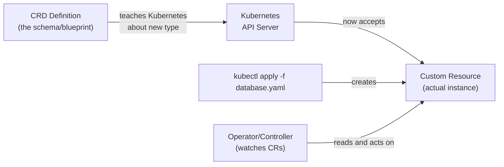

---

## Q99. What is an Operator pattern? How does it differ from a plain Deployment?

### Simple Explanation
An Operator is a Kubernetes controller that manages complex, stateful applications. A plain Deployment just runs pods. An Operator actually understands the application — it knows how to set up a database cluster, handle failover, run backups, upgrade versions safely, and recover from failures.

### Real-World Analogy
- **Plain Deployment** = a vending machine. It just keeps snacks stocked. No intelligence.
- **Operator** = a human expert who manages a restaurant. They know when to reorder ingredients, how to fix broken equipment, how to train new staff, and handle all the complex situations automatically.

### Practical

**Plain Deployment — just runs containers:**
```yaml
apiVersion: apps/v1
kind: Deployment
metadata:
  name: my-app
spec:
  replicas: 3
  template:
    spec:
      containers:
      - name: my-app
        image: my-app:v1
# If a pod dies, it restarts. That is ALL it knows.
```

**Operator — manages a PostgreSQL cluster (using CloudNativePG operator):**
```yaml
apiVersion: postgresql.cnpg.io/v1
kind: Cluster
metadata:
  name: my-postgres
spec:
  instances: 3
  primaryUpdateStrategy: unsupervised
  storage:
    size: 100Gi
  backup:
    retentionPolicy: "30d"
    barmanObjectStore:
      destinationPath: s3://my-backups/postgres
# The operator knows: which pod is primary, handles failover,
# runs automated backups, handles upgrades safely
```

```bash
# Install an operator (example: cert-manager)
kubectl apply -f https://github.com/cert-manager/cert-manager/releases/download/v1.14.0/cert-manager.yaml

# Now you can use Certificate resources
kubectl get certificates -A
```

| Feature | Plain Deployment | Operator |
|---|---|---|
| Restarts failed pods | Yes | Yes |
| Handles database failover | No | Yes |
| Runs automated backups | No | Yes |
| Knows app-specific logic | No | Yes |
| Safe rolling upgrades | Basic | Application-aware |

---

## Q100. What is the Operator SDK / Kubebuilder?

### Simple Explanation
Operator SDK and Kubebuilder are frameworks (toolkits) that help developers BUILD their own operators. Writing an operator from scratch is very complex. These tools generate the boilerplate code and let you focus on the business logic.

### Real-World Analogy
Building an operator from scratch is like building a car from raw metal. Operator SDK / Kubebuilder is like buying a car kit — the frame, engine, and wheels are already made. You just add the custom parts you need.

### Practical

**Using Kubebuilder to scaffold a new operator:**
```bash
# Install kubebuilder
curl -L -o kubebuilder "https://go.kubebuilder.io/dl/latest/$(go env GOOS)/$(go env GOARCH)"
chmod +x kubebuilder && mv kubebuilder /usr/local/bin/

# Create a new project
mkdir my-operator && cd my-operator
kubebuilder init --domain mycompany.com --repo github.com/mycompany/my-operator

# Create an API (CRD + Controller)
kubebuilder create api --group apps --version v1 --kind MyApp

# This generates:
# api/v1/myapp_types.go       <-- define your CRD schema here
# controllers/myapp_controller.go  <-- write your reconcile logic here
```

**Generated reconcile function (you fill in the logic):**
```go
func (r *MyAppReconciler) Reconcile(ctx context.Context, req ctrl.Request) (ctrl.Result, error) {
    log := log.FromContext(ctx)

    // Fetch the MyApp resource
    myApp := &appsv1.MyApp{}
    if err := r.Get(ctx, req.NamespacedName, myApp); err != nil {
        return ctrl.Result{}, client.IgnoreNotFound(err)
    }

    // Your custom logic here:
    // - Create/update a Deployment based on myApp.Spec
    // - Create a Service
    // - Update myApp.Status

    log.Info("Reconciling MyApp", "name", myApp.Name)
    return ctrl.Result{}, nil
}
```

```bash
# Build and deploy the operator
make docker-build docker-push IMG=myregistry/my-operator:v1
make deploy IMG=myregistry/my-operator:v1
```
