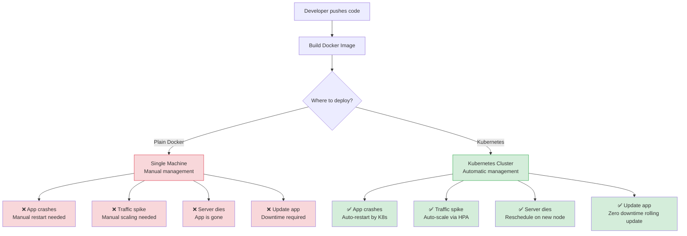
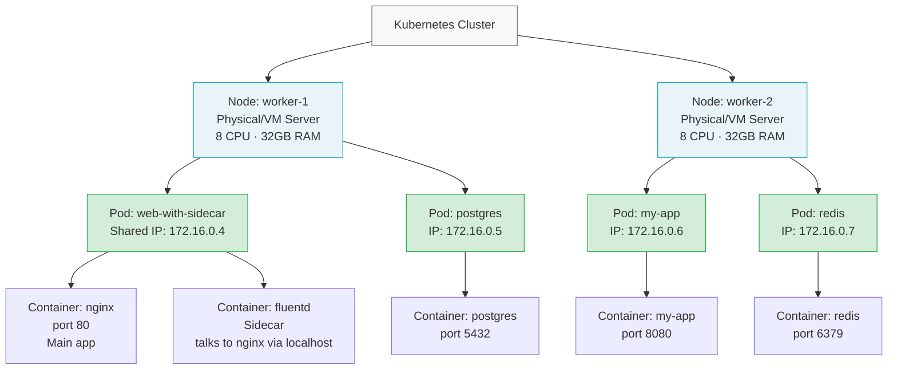

# Kubernetes Interview Complete Guide
### Practical + Theoretical — Simple English, Real Examples, Diagrams

---

## TIER 1 — Fundamentals (Junior / 0-2 Years)

---

## Q1. What is Kubernetes and why do we need it over plain Docker?

### Simple Explanation

Docker solves one problem — packaging your application into a container so it runs the same everywhere. But Docker alone has **no answer for production-scale problems**:

- What happens when your container crashes at 3AM? Docker does nothing — you restart it manually.
- What if your app gets 10x traffic suddenly? Docker cannot automatically add more containers.
- What if the server (host machine) dies? Your container dies with it — no recovery.
- How do you update your app without taking it down for maintenance?

**Kubernetes solves all of these.** It is a container orchestration platform — meaning it manages containers across many machines automatically. You declare what you want ("I want 5 copies of my app always running") and Kubernetes makes it happen and keeps it that way, 24/7, without any manual action from you.

**Key things Kubernetes does that Docker alone cannot:**

| Problem | Docker | Kubernetes |
|---|---|---|
| Container crashes | Stays dead until you restart manually | Auto-restarts immediately |
| High traffic | You manually run more containers | Auto-scaling via HPA |
| Server dies | App is gone | Reschedules pods on a healthy server |
| App update | Manual, causes downtime | Rolling update with zero downtime |
| Load balancing | Not built-in | Built-in via Services |
| Config & secret management | Manual | ConfigMap and Secrets objects |
| Health checking | Basic only | Liveness, Readiness, Startup probes |
| Storage management | Manual volume mounts | PersistentVolumes and PVCs |

### Real-World Analogy

Think of Docker as hiring **one chef** and giving them a kitchen. That works fine for a small café. But when you open a restaurant chain with 50 branches, you need a **restaurant manager** (Kubernetes) who:

- Automatically hires and replaces chefs when one is sick (self-healing)
- Reassigns chefs from a slow branch to a busy one (scheduling)
- Makes sure every branch follows the same recipe (container image)
- Updates the recipe across all branches without closing any branch (rolling update)
- Tracks how busy each kitchen is and calls in extra help when needed (auto-scaling)

You (the developer) just say "I want 3 copies of my app running at all times." Kubernetes does everything else.

### Practical

```bash
# ---------- Docker way — you do everything manually ----------

# Start a single container
docker run -d --name my-app nginx:latest

# App crashes at 3AM → you manually restart
docker start my-app

# Traffic spikes → you manually start more
docker run -d --name my-app-2 nginx:latest
docker run -d --name my-app-3 nginx:latest

# Server dies → all containers gone, you start from scratch on new server

# ---------- Kubernetes way — you declare desired state ----------

# Create a deployment with 3 replicas
kubectl create deployment my-app --image=nginx:latest --replicas=3

# App crashes → K8s auto-restarts it (you don't wake up)
# Traffic spikes → HPA auto-adds more pods
# Server dies → K8s reschedules pods on healthy servers

# Check that all 3 replicas are healthy
kubectl get pods -l app=my-app
# NAME                      READY   STATUS    RESTARTS   AGE
# my-app-7d6b9c-abc12      1/1     Running   0          2m
# my-app-7d6b9c-def34      1/1     Running   0          2m
# my-app-7d6b9c-ghi56      1/1     Running   0          2m

# Kill one pod manually to see K8s self-healing
kubectl delete pod my-app-7d6b9c-abc12
# K8s immediately creates a replacement — pod count stays at 3
kubectl get pods -l app=my-app
# my-app-7d6b9c-def34      1/1     Running   0          3m
# my-app-7d6b9c-ghi56      1/1     Running   0          3m
# my-app-7d6b9c-xyz99      1/1     Running   0          5s  ← new pod
```

### Diagram



### What to Say in an Interview

> *"Docker packages the app. Kubernetes runs and manages it at scale. Docker alone has no self-healing, no auto-scaling, no rolling updates, and no cross-machine coordination. In production, you always need an orchestrator — and Kubernetes is the industry standard for that. The key idea is declarative management — you tell Kubernetes what state you want, and it continuously works to maintain that state."*

---

## Q2. What is the difference between a Container, Pod, and Node?

### Simple Explanation

These are 3 different **levels** in Kubernetes — each one wraps the next. Understanding this hierarchy is fundamental to everything else in Kubernetes.

---

**Container:**

A container is a running instance of your Docker image. It has its own isolated filesystem, its own process space, and its own resource limits (CPU and memory). One container typically runs one process — your web app, your database, your log shipper. It is the smallest unit in Docker — but **NOT in Kubernetes**.

---

**Pod:**

In Kubernetes, the **smallest deployable unit is a Pod**, not a container. A Pod is a thin wrapper around one or more containers that:

- **Always run together** on the same Node — you cannot split containers from the same Pod across different machines
- **Share the same network namespace** — they get one shared IP address, and containers inside the same Pod can talk to each other via `localhost` (no Service needed)
- **Can share storage volumes** — containers in the same Pod can read and write to the same volume

**Why does Pod exist?** Because real applications often have tightly coupled processes. Example: a web server (nginx) and a log collector (fluentd) must always run on the same machine so the log collector can read the web server's log files. Grouping them in a Pod guarantees they are always co-located.

The most common pattern for multi-container Pods is the **Sidecar pattern** — a helper container that runs alongside the main container.

---

**Node:**

A Node is an actual machine — a physical server or a virtual machine — where Pods are scheduled and run. Each Node must have:

- **kubelet** — the agent that receives instructions from the API server and manages Pods on that node
- **Container runtime** — containerd or Docker, which actually pulls images and starts/stops containers
- **kube-proxy** — sets up network rules so traffic reaches the right Pods

A Kubernetes cluster has multiple Nodes. The Scheduler decides which Node each Pod runs on based on available resources, taints, affinities, and other rules.

---

**The full hierarchy:**

```
Cluster
  └── Node (server/VM)
        └── Pod (group of containers, one IP)
              └── Container (one running process)
```

### Real-World Analogy

Think of a **cargo shipping system**:

- **Container** = the actual goods packed inside (your application process)
- **Pod** = the shipping container box (holds related items together, treated as one unit — loaded and unloaded together)
- **Node** = the cargo ship (carries many shipping containers across the sea)
- **Cluster** = the entire shipping company fleet (many ships working together)

Just like items inside one shipping container share the same location during transport, containers inside one Pod share the same network location (IP address).

### Practical

```bash
# ---- Nodes ----

# See all nodes in your cluster
kubectl get nodes
# NAME        STATUS   ROLES           AGE   VERSION
# master-1    Ready    control-plane   10d   v1.28.0
# worker-1    Ready    <none>          10d   v1.28.0
# worker-2    Ready    <none>          10d   v1.28.0

# See detailed info about a node (capacity, conditions, pods running on it)
kubectl describe node worker-1

# ---- Pods ----

# See all pods and WHICH NODE they are running on
kubectl get pods -o wide
# NAME              READY   STATUS    NODE       IP
# my-app-abc123     1/1     Running   worker-1   172.16.0.4
# my-app-def456     1/1     Running   worker-2   172.16.0.5

# See what containers are inside a specific pod
kubectl describe pod my-app-abc123
# Look for the "Containers:" section — lists each container's name, image, ports

# ---- Containers inside a Pod ----

# Exec into the main container of a pod
kubectl exec -it my-app-abc123 -- /bin/sh

# Exec into a specific container in a multi-container pod (use -c flag)
kubectl exec -it my-app-abc123 -c log-sidecar -- /bin/sh
```

```yaml
# Multi-container Pod — web server + sidecar log collector
# Both containers share the same IP and the same "logs" volume
apiVersion: v1
kind: Pod
metadata:
  name: web-with-sidecar
  labels:
    app: web
spec:
  containers:

  - name: web-app              # Main container — serves HTTP traffic
    image: nginx:1.25
    ports:
    - containerPort: 80
    volumeMounts:
    - name: logs
      mountPath: /var/log/nginx  # Nginx writes logs here

  - name: log-sidecar           # Sidecar container — collects and ships logs
    image: fluentd:v1.16
    # This container can reach web-app via localhost:80
    # because they share the same network namespace
    volumeMounts:
    - name: logs
      mountPath: /var/log/nginx  # Reads the same log files

  volumes:
  - name: logs
    emptyDir: {}                 # Shared temporary storage for both containers
```

### Diagram



### Key Differences — Quick Reference

| | Container | Pod | Node |
|---|---|---|---|
| **What it is** | Running process | Group of containers | Server / VM |
| **Has its own IP?** | No (shares Pod IP) | Yes — one IP per Pod | Yes |
| **Managed by** | Container runtime | kubelet | Kubernetes scheduler |
| **Smallest unit in** | Docker | Kubernetes | — |
| **Can span machines?** | No | No | Yes (cluster = many nodes) |
| **Common count** | 1 per Pod (usually) | Many per Node | Many per Cluster |

### What to Say in an Interview

> *"Container is the running process. Pod is the smallest unit Kubernetes schedules — it groups one or more containers that must always run together, share the same IP address, and can share volumes. Node is the actual machine where Pods are placed. The hierarchy is: Cluster → Nodes → Pods → Containers. The key thing interviewers want to hear is that in Kubernetes, you never work with containers directly — you always work with Pods, and Pods are what the scheduler places on Nodes."*

---
